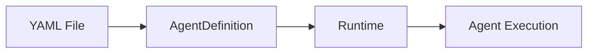

# Markdown Documentation Guidelines

## Starlight Components

When writing documentation, use Starlight components for rich content presentation.

### File Trees

Use the `<FileTree>` component for directory structures instead of ASCII art:

```mdx
import { FileTree } from "@astrojs/starlight/components";

<FileTree>

- src
  - components
    - **Header.astro** an important file
    - Title.astro
  - pages/
  - …

</FileTree>
```

- Use `**filename**` to highlight important files
- Add comments after filenames for descriptions
- Use `…` as placeholder for additional files
- End directory names with `/` if they have no children listed

### Steps

Use the `<Steps>` component for numbered instructions and tutorials:

````mdx
import { Steps } from "@astrojs/starlight/components";

<Steps>

1. First step with explanation

   ```bash
   npm install agentschema
   ```
````

2. Second step with more detail

3. Final step

</Steps>
```

### Tabs

Use `<Tabs>` and `<TabItem>` for language-specific examples:

````mdx
import { Tabs, TabItem } from "@astrojs/starlight/components";

<Tabs syncKey="language">
  <TabItem label="Python" icon="seti:python">
    ```python from agentschema import AgentDefinition ```
  </TabItem>
  <TabItem label="TypeScript" icon="seti:typescript">
    ```typescript import {AgentDefinition} from 'agentschema'; ```
  </TabItem>
  <TabItem label="C#" icon="seti:csharp">
    ```csharp using AgentSchema; ```
  </TabItem>
</Tabs>
````

- Use `syncKey="language"` to sync tabs across the page
- Available icons: `seti:python`, `seti:typescript`, `seti:c-sharp`, `seti:go`

### Mermaid Diagrams

Use Mermaid for process flows, architecture diagrams, and relationships:

````mdx

````

````

Common diagram types:
- `flowchart LR/TD` - Process flows (left-right or top-down)
- `sequenceDiagram` - API interactions and message flows
- `classDiagram` - Object relationships
- `stateDiagram-v2` - State machines

**Important**: Node labels containing special characters like `@` must be quoted:

```text
A["@sample decorator"] --> B[Emitter]  ✅ Correct - quoted
A[@sample decorator] --> B[Emitter]    ❌ Wrong - will error
```

## Linting

All markdown files in `docs/` must pass markdownlint. Run the linter with:

```bash
npx markdownlint-cli2 "docs/src/content/docs/**/*.md"
````

## Key Rules

### MD012 - No Multiple Blank Lines

Use only single blank lines between sections. Do NOT use consecutive blank lines.

### MD040 - Fenced Code Language

Always specify a language for code blocks:

```text
# ASCII diagrams or plain text
```

```bash
# Shell commands
```

```typespec
# TypeSpec code
```

### MD004 - Unordered List Style

Use dashes (`-`) for unordered lists, not asterisks (`*`):

```markdown
- Item one
- Item two
```

### MD047 - Single Trailing Newline

Files must end with exactly one newline character.

### MD031 - Blanks Around Fences

Fenced code blocks must have blank lines before and after.

### MD022 - Blanks Around Headings

Headings must have blank lines before and after.

## Auto-Generated Files

Files in `docs/src/content/docs/reference/` are auto-generated from the TypeSpec emitter.
To fix lint errors in these files:

1. Edit templates in `agentschema-emitter/src/templates/markdown/`
2. Rebuild: `cd agentschema-emitter && npx tsc && cp -r src/templates dist/src/`
3. Regenerate: `cd agentschema && npm run generate`

## Contributing Docs

Files in `docs/src/content/docs/contributing/` are manually maintained. Ensure:

1. Code blocks have language identifiers
2. Lists use dashes (`-`)
3. Single blank lines between sections

## Git Release Tags

When creating release tags, always use **annotated tags** with a message:

```bash
# Correct - annotated tag with message
git tag -a "csharp-v1.0.0-beta.4" -m "C# SDK v1.0.0-beta.4: description of changes"

# Wrong - lightweight tag (no message)
git tag "csharp-v1.0.0-beta.4"
```

Tag naming conventions:

- **Emitter**: `emitter-v0.1.X`
- **C#**: `csharp-v1.0.0-beta.X`
- **Python**: `python-v1.0.0bX` (PEP 440 format)
- **TypeScript**: `typescript-v1.0.0-beta.X`
- **Go**: `go-v1.0.0-beta.X`
- **Docs**: `docs-v1.0.0-beta.X`

See [PUBLISHING.md](/PUBLISHING.md) for complete publishing instructions.
