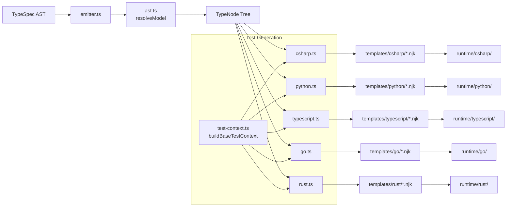

import { FileTree } from '@astrojs/starlight/components';

The emitter transforms TypeSpec definitions into runtime code for C#, Python, TypeScript, Go, and Rust. This guide covers how to modify code generation.

## Architecture Overview

<FileTree>

- agentschema-emitter/
  - src/
    - **emitter.ts** entry point - dispatches to generators
    - **ast.ts** TypeSpec AST parsing (TypeNode, PropertyNode, BaseTestContext)
    - **test-context.ts** shared test context builder for all languages
    - **decorators.ts** custom decorator handling
    - **utilities.ts** helper functions
    - csharp.ts C# code generator
    - python.ts Python code generator
    - typescript.ts TypeScript code generator
    - go.ts Go code generator
    - rust.ts Rust code generator
    - markdown.ts documentation generator
    - templates/ Nunjucks templates
      - csharp/
      - python/
      - typescript/
      - go/
  - dist/ compiled output (git-ignored)

</FileTree>



## Key Concepts

### TypeNode and PropertyNode

The `ast.ts` file defines the core data structures passed to templates:

```typescript
class TypeNode {
  typeName: { namespace: string; name: string };
  description: string;
  base: TypeName | null;           // Parent type
  childTypes: TypeNode[];          // Derived types
  properties: PropertyNode[];
  isAbstract: boolean;
  discriminator?: string;
  alternates: Alternative[];       // Shorthand representations
}

class PropertyNode {
  name: string;
  typeName: TypeName;
  description: string;
  isScalar: boolean;
  isOptional: boolean;
  isCollection: boolean;
  samples: SampleEntry[];
  defaultValue: any;
}
```

### Code Generation Flow

1. `emitter.ts` receives the TypeSpec program
2. `resolveModel()` builds the TypeNode tree from the root object
3. `enumerateTypes()` yields all types for code generation
4. Language-specific generators render templates for each type

## Modifying Templates

Templates use [Nunjucks](https://mozilla.github.io/nunjucks/) syntax. Each language has templates for:

| File | Purpose |
|------|---------|
| `file.{ext}.njk` | Main class definitions |
| `test.{ext}.njk` | Test file generation (uses standardized context) |
| `_macros.njk` | Shared template macros |
| `context.*.njk` | LoadContext/SaveContext classes |

### Test Context Standardization

All test templates use the shared `buildBaseTestContext()` function from `test-context.ts`. This ensures consistent field names across all languages:

```typescript
// In your language generator
import { buildBaseTestContext, yourLanguageTestOptions } from "./test-context.js";

function buildTestContext(node: TypeNode, packageName: string): BaseTestContext {
  return buildBaseTestContext(node, packageName, yourLanguageTestOptions);
}
```

**Standardized field names in test templates:**

| Field | Description |
|-------|-------------|
| `validations` | Array of property assertions (not `validation`) |
| `delimiter` | Quote character for strings (not `delimeter`) |
| `scalarType` | The scalar type name (not `scalar`) |
| `isOptional` | Whether property is optional (not `isPointer`) |
| `package` | Package/namespace (not `packageName`) |

### Template Syntax

```twig
{# Comment #}
{{ variable }}                    {# Output variable #}
{{ value | lower }}               {# Apply filter #}
...  {# Conditional #}
...  {# Loop #}
                       {# Trim whitespace #}
```

### Common Patterns

**Rendering property names:**

```twig
{# C# - PascalCase #}
{{ renderName(prop.name) }}

{# Python - snake_case (handled in generator) #}
{{ prop.name }}

{# TypeScript - camelCase #}
{{ prop.name }}

{# Go - PascalCase (exported) #}
{{ renderName(prop.name) }}
```

**Type mapping:**

```twig

  {{ typeMapper[prop.typeName.name] }}

  {{ prop.typeName.name }}

```

**Handling optionals:**

```twig
{# C# #}
{{ type }}?

{# Python #}
Optional[{{ type }}]

{# TypeScript #}
{{ prop.name }}?: {{ type }}

{# Go - uses pointer for optional #}
*{{ type }}
```

## Adding a New Feature

### Example: Add a new property to generated classes

1. **Edit the TypeScript generator** (e.g., `csharp.ts`):

```typescript
// In buildClassContext or similar
const context = {
  node,
  newFeature: computeNewFeature(node),
  // ...
};
```

1. **Update the template** (e.g., `templates/csharp/file.cs.njk`):

```twig

/// <summary>New feature documentation</summary>
public string NewFeature => "{{ newFeature }}";

```

1. **Rebuild and test:**

```bash
cd agentschema-emitter
npx tsc
cp -r src/templates dist/src/

cd ../agentschema
npm run generate

cd ../runtime/csharp && dotnet test
```

## YAML Generation

For test data, use the YAML library with proper escaping:

```typescript
import * as YAML from "yaml";

const doc = new YAML.Document(sample);
YAML.visit(doc, {
  Scalar(key, node) {
    if (typeof node.value === 'string') {
      const str = node.value as string;
      // Quote strings with special characters
      if (str.includes('\n') || str.includes('#')) {
        node.type = 'QUOTE_DOUBLE';
      }
    }
  }
});
const yaml = doc.toString({ indent: 2, lineWidth: 0 });
```

## Build Process

:::caution[Critical Step]
Always copy templates to `dist/` after compiling TypeScript!
:::

```bash
cd agentschema-emitter

# Compile TypeScript
npx tsc

# Copy templates (REQUIRED - templates aren't compiled)
cp -r src/templates dist/src/

# On Windows PowerShell:
Copy-Item -Recurse -Force src/templates dist/src/
```

## Testing Changes

After any emitter change, test all runtimes:

```bash
# C#
cd runtime/csharp && dotnet test

# Python
cd runtime/python/agentschema && uv run pytest tests/

# TypeScript
cd runtime/typescript/agentschema && npm test

# Go
cd runtime/go/agentschema && go test ./...

# Rust
cd runtime/rust/agentschema && cargo test
```

## Debugging Tips

1. **Print AST data:** Add `console.log(JSON.stringify(node, null, 2))` in generators
2. **Check template context:** Log the context object before rendering
3. **Inspect generated files:** Look at output in `runtime/` to verify changes
4. **Run single runtime:** Focus on one language while iterating

## Common Issues

### Templates not updating

Forgot to copy templates to `dist/src/`. Run:

```bash
cp -r src/templates dist/src/
```

### Type errors in generated code

Check type mappers in the language generator (e.g., `csharpTypeMapper`).

### Missing imports in generated files

Update the imports array in the template context or `_macros.njk`.
