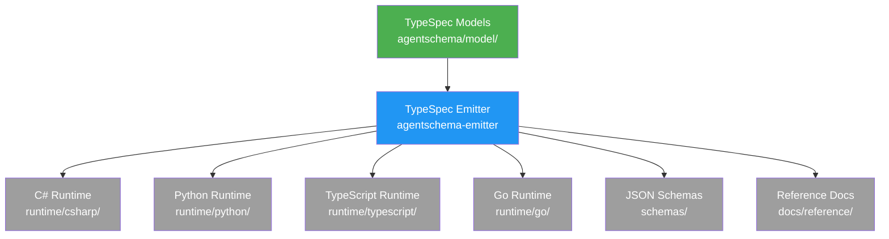

import { FileTree } from '@astrojs/starlight/components';

AgentSchema is a collaborative project between Microsoft Copilot Studio and Microsoft Foundry. We welcome contributions to the specification, runtime libraries, and documentation!

## Project Architecture

AgentSchema uses a code generation approach where:

1. **TypeSpec definitions** define the schema (source of truth)
2. **Custom emitter** generates runtime code for multiple languages
3. **Runtime libraries** are auto-generated (C#, Python, TypeScript, Go)

<FileTree>

- agentschema/model/ **Edit these** (source of truth)
  - main.tsp
  - agent.tsp
  - tools.tsp
  - …
- agentschema-emitter/ **Or edit templates here**
  - src/
    - templates/
- runtime/ ⚠️ DO NOT edit directly
  - csharp/
  - python/
  - typescript/
  - go/
- schemas/ ⚠️ DO NOT edit directly

</FileTree>

## What Can I Contribute?

| Area | Location | Description |
|------|----------|-------------|
| Schema changes | `agentschema/model/*.tsp` | Add/modify agent schema definitions |
| Code generation | `agentschema-emitter/src/` | Improve generated code quality |
| Documentation | `docs/src/content/` | Improve guides and examples |
| Examples | `examples/` | Add new agent examples |
| Bug fixes | Various | Fix issues in emitter or runtime config |

## Quick Links

- [Project Setup](/AgentSchema/contributing/setup/) - Get your development environment ready
- [TypeSpec Guide](/AgentSchema/contributing/typespec/) - How to edit schema definitions
- [Emitter Guide](/AgentSchema/contributing/emitter/) - How to modify code generation
- [Testing Guide](/AgentSchema/contributing/testing/) - How to run tests

## Important Rules

:::caution[Do Not Edit Generated Files]
Files in `runtime/`, `schemas/`, and `docs/src/content/docs/reference/` are **auto-generated**. Changes must be made in the TypeSpec source or emitter templates.
:::

## Getting Help

- **Issues**: [GitHub Issues](https://github.com/microsoft/AgentSchema/issues)
- **Discussions**: [GitHub Discussions](https://github.com/microsoft/AgentSchema/discussions)
