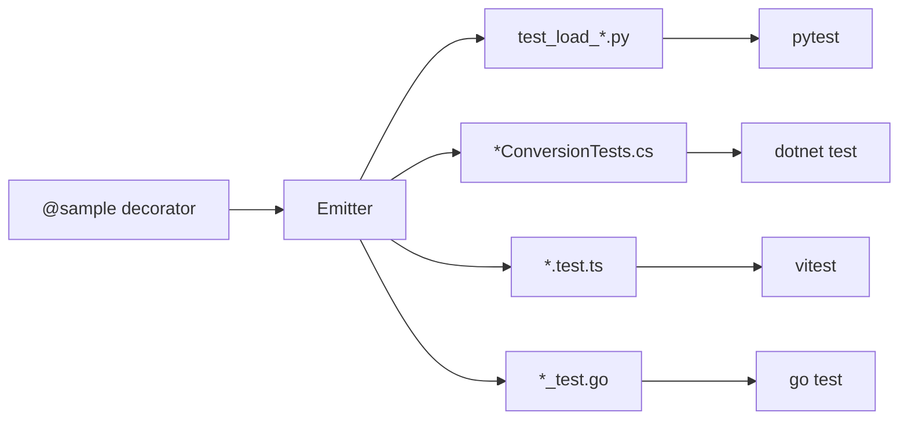

import { Tabs, TabItem } from '@astrojs/starlight/components';

Tests are auto-generated for runtime libraries based on `@sample` decorators in TypeSpec. This guide covers running tests and understanding the test architecture.

## Running Tests

<Tabs syncKey="language">
  <TabItem label=".NET" icon="seti:c-sharp">
    ```bash
    cd runtime/csharp
    dotnet test                           # All tests
    dotnet test --filter "ClassName"      # Specific class
    ```
  </TabItem>
  <TabItem label="Python" icon="seti:python">
    ```bash
    cd runtime/python/agentschema
    uv run pytest tests/                  # All tests
    uv run pytest tests/test_load_model.py  # Specific file
    uv run pytest -v                      # Verbose output
    ```
  </TabItem>
  <TabItem label="TypeScript" icon="seti:typescript">
    ```bash
    cd runtime/typescript/agentschema
    npm test                              # All tests
    npm test -- --grep "Model"           # Filter by name
    ```
  </TabItem>
  <TabItem label="Go" icon="seti:go">
    ```bash
    cd runtime/go/agentschema
    go test ./...                         # All tests
    go test -run "TestModel"              # Filter by name
    go test -v ./...                      # Verbose output
    ```
  </TabItem>
</Tabs>

## Test Architecture

Tests are generated from `@sample` decorators in TypeSpec files. For each model:



### What Gets Tested

1. **JSON Loading** - Parse JSON into model instance
2. **YAML Loading** - Parse YAML into model instance  
3. **JSON Roundtrip** - Load → Save → Load produces same data
4. **YAML Roundtrip** - Load → Save → Load produces same data
5. **Shorthand Loading** - Scalar → Full model (if `@shorthand` defined)

### Example Generated Test (Python)

```python
def test_load_json_model():
    json_data = '''
    {
      "id": "gpt-4",
      "provider": "azure"
    }
    '''
    data = json.loads(json_data)
    instance = Model.load(data)
    assert instance is not None
    assert instance.id == "gpt-4"
    assert instance.provider == "azure"

def test_roundtrip_json_model():
    json_data = '''{"id": "gpt-4", "provider": "azure"}'''
    original = json.loads(json_data)
    instance = Model.load(original)
    saved = instance.save()
    reloaded = Model.load(saved)
    assert reloaded.id == instance.id
```

## Adding Test Coverage

### Via @sample Decorators

The best way to add test coverage is through `@sample` decorators:

```typespec
model MyModel {
  @doc("Name of the model")
  @sample(#{ name: "test-model" })      // Generates test with this value
  @sample(#{ name: "another-model" })   // Multiple samples = multiple tests
  name: string;
}
```

### Test Combinations

When a model has multiple properties with `@sample`, the emitter generates test combinations:

```typespec
model Example {
  @sample(#{ a: "value1" })
  @sample(#{ a: "value2" })
  a: string;
  
  @sample(#{ b: 1 })
  @sample(#{ b: 2 })
  b: int32;
}
// Generates 4 tests: (value1, 1), (value1, 2), (value2, 1), (value2, 2)
```

## Manual Test Files

Some tests are not auto-generated and can be edited:

| Runtime | Location | Notes |
|---------|----------|-------|
| C# | `runtime/csharp/AgentSchema.Tests/` | Project files are preserved |
| Python | `runtime/python/agentschema/tests/` | `conftest.py` is preserved |
| TypeScript | `runtime/typescript/agentschema/tests/` | Config files are preserved |
| Go | `runtime/go/agentschema/` | `go.mod` is preserved |

:::caution
Test files matching `test_load_*.py`, `*ConversionTests.cs`, `*.test.ts`, or `*_test.go` patterns ARE regenerated. Add custom tests with different naming patterns.
:::

## Test Validation Patterns

### Property Assertions

Tests validate scalar properties from `@sample` values:

```python
# Python
assert instance.name == "expected-value"
assert instance.count == 42
assert instance.enabled == True

# TypeScript
expect(instance.name).toEqual("expected-value");

# C#
Assert.Equal("expected-value", instance.Name);

# Go
if instance.Name != "expected-value" {
    t.Errorf("Expected name to be 'expected-value', got %v", instance.Name)
}
```

### Type Checks

```python
# Python
assert isinstance(instance.items, list)

# TypeScript  
expect(Array.isArray(instance.items)).toBe(true);

# C#
Assert.IsType<List<string>>(instance.Items);

# Go
if len(instance.Items) == 0 {
    t.Error("Expected items to be non-empty")
}
```

## Debugging Test Failures

### 1. Check the Sample Values

Ensure `@sample` values in TypeSpec are valid:

```typespec
// ❌ Wrong - sample doesn't match property
@sample(#{ wrongName: "value" })
name: string;

// ✅ Correct
@sample(#{ name: "value" })
name: string;
```

### 2. Regenerate Tests

```bash
cd agentschema && npm run generate
```

### 3. Check Generated Test File

Look at the actual generated test to understand what's being tested:

```bash
# Python
cat runtime/python/agentschema/tests/test_load_model.py

# TypeScript
cat runtime/typescript/agentschema/tests/model.test.ts
```

### 4. Run Single Test with Verbose Output

```bash
# Python
uv run pytest tests/test_load_model.py::test_load_json_model -v

# TypeScript
npm test -- --grep "Model" --reporter verbose

# C#
dotnet test --filter "ModelConversionTests" --logger "console;verbosity=detailed"

# Go
go test -v -run "TestModel" ./...
```

## CI/CD

Tests run automatically on:

- Pull requests
- Pushes to main branch

See `.github/workflows/` for CI configuration.
