import { FileTree, Steps } from '@astrojs/starlight/components';

The Analyst Agent is a sales data analysis agent that demonstrates how to use Code Interpreter and File Search tools to analyze uploaded CSV files and provide insights on sales performance, customer trends, and product analysis.

## Example Structure

<FileTree>

- examples/analyst/
  - **analyst.yaml** the agent definition
  - **analyst_manifest.yaml** parameterized template
  - sales_data.csv sample data

</FileTree>

## Agent Definition (`analyst.yaml`)

The basic agent definition shows a simple configuration:

```yaml
name: Sales Analyst Agent
description: |-
  This agent helps users analyze sales data by leveraging the Code Interpreter tool
  for data analysis and a File Search tool to access uploaded sales documents.
  The agent provides insights on sales performance, customer trends, and product analysis.

metadata:
  tags:
    - example
    - analyst
  authors:
    - sethjuarez
    - jietong

model: gpt-4o

tools:
  code_interpreter_tool:
    kind: code_interpreter
    description: An API to extract intent from a given message.
    fileIds:
      - sales_data_csv

  file_search_tool:
    kind: file_search
    description: An API to search files that have been uploaded to the agent.
    connection: file_search_connection
    ranker: default
    scoreThreshold: 0.5
    maxResults: 5
    maxContentLength: 2000
    vectorStoreIds:
      - sales_data_vector_store

instructions: |-
  You are an expert sales analyst.
  Use the uploaded sales data to answer questions about orders, customers, regions, and product performance.
  Always explain your reasoning and cite relevant files or calculations.
```

## Agent Template (`analyst_manifest.yaml`)

The template version provides a more flexible, reusable configuration:

### Key Components

**Model Configuration:**

- Uses `gpt-4o` as the AI model
- Defined as a resource for deployment flexibility

**Tools:**

- **Code Interpreter Tool**: Enables Python code execution for data analysis
  - `fileIds: {{fileIds}}` - Parameterized file references
- **File Search Tool**: Searches through uploaded documents
  - `connection: {{file_search_connection}}` - Parameterized connection
  - `vectorStoreIds: {{vectorStoreIds}}` - Parameterized vector stores
  - Configured with search parameters (score threshold, max results, content length)

**Template Parameters:**

```yaml
parameters:
  file_search_connection:
    kind: string
    required: true
  vectorStoreIds:
    kind: array
    items:
      kind: string
    required: true
  fileIds:
    kind: array
    items:
      kind: string
    required: true
```

**Resources:**

```yaml
resources:
  gpt-4o-deployment:
    kind: model
    id: gpt-4o
  file_search_tool:
    kind: tool
    id: file_search
```

## How It Works

```mermaid
flowchart LR
    A[📁 CSV Upload] --> B[📊 File Indexing]
    B --> C[🔍 Vector Store]
    C --> D[🤖 Agent]
    D --> E[🐍 Code Interpreter]
    D --> F[🔎 File Search]
    E --> G[📈 Analysis Results]
    F --> G
```



<Steps>

1. **Data Upload**

   Users upload CSV files containing sales data to the agent.

2. **File Indexing**

   Files are indexed in vector stores for semantic search capabilities.

3. **Analysis Request**

   User asks a question about the sales data.

4. **Tool Execution**

   The agent uses Code Interpreter to run Python code for data analysis, and File Search to retrieve relevant information.

5. **Insights Delivery**

   Agent provides detailed analysis with explanations and citations from the source data.

</Steps>

## Use Cases

- Sales performance analysis
- Customer trend identification
- Product analysis and recommendations
- Data-driven business insights
- Report generation from raw sales data

## Template Benefits

The manifest template approach allows for:

- **Reusability**: Deploy the same agent with different data sources
- **Flexibility**: Parameterize connections and file references
- **Deployment**: Easy configuration for different environments
- **Maintenance**: Update agent logic without changing deployment configs

---

[← Back to Guides](/guides/)
