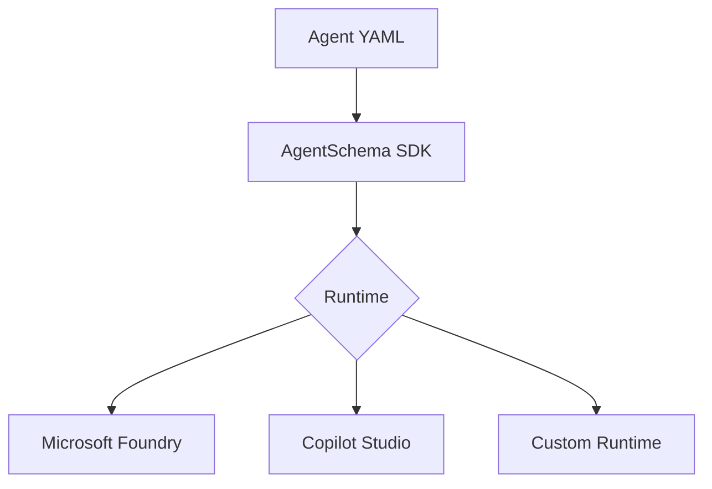

import { Card, CardGrid, FileTree } from '@astrojs/starlight/components';

Welcome to the AgentSchema guides! This section provides step-by-step tutorials and comprehensive documentation to help you get started with AgentSchema.

## About AgentSchema

AgentSchema is a declarative specification format for defining AI agents and their capabilities. It provides a standardized way to describe agent behavior, tools, connections, and resources in a structured, platform-agnostic manner.

With AgentSchema, you can:

- **Define Agent Behavior**: Specify prompts, instructions, and conversation flows
- **Configure Tools**: Integrate external APIs, functions, and services
- **Manage Connections**: Handle authentication and external service integrations
- **Template Variables**: Create reusable, configurable agent definitions
- **Cross-Platform Support**: Deploy agents across different runtime environments

## Examples

Explore real-world examples to understand how AgentSchema works in practice:

<FileTree>

- examples/
  - analyst/ Sales data analysis with Code Interpreter
    - **analyst.yaml**
    - analyst_manifest.yaml
  - qna/ Q&A with Azure CLU
    - **qna.yml**
    - qna_manifest.yml
  - travel/ Travel planning with APIs
    - **travel.yaml**
    - travel_manifest.yaml

</FileTree>

<CardGrid>
  <Card title="📊 Analyst Agent" icon="document">
    Sales data analysis using Code Interpreter and File Search tools.
    
    [View Example →](analyst-agent/)
  </Card>
  <Card title="❓ QnA Agent" icon="comment">
    Question answering with Azure Cognitive Language Understanding.
    
    [View Example →](qna-agent/)
  </Card>
  <Card title="✈️ Travel Agent" icon="rocket">
    Travel planning with Bing Search and TripAdvisor APIs.
    
    [View Example →](travel-agent/)
  </Card>
  <Card title="📖 Manifest vs Definition" icon="open-book">
    Understanding when to use templates vs direct definitions.
    
    [Learn More →](example/)
  </Card>
  <Card title="⚙️ Code Generation" icon="setting">
    Generate runtime libraries for Python, C#, TypeScript, and Go.
    
    [Use the Emitter →](emitter/)
  </Card>
</CardGrid>

## Reference Documentation

Complete reference documentation for all AgentSchema components is available, including:

### Core Components

- **[AgentDefinition](../reference/agentdefinition/)** - Main agent specification structure
- **[AgentManifest](../reference/agentmanifest/)** - Agent metadata and deployment configuration  
- **[Model](../reference/model/)** - AI model configuration and options
- **[Tools](../reference/tool/)** - Available tool types ([OpenAPI](../reference/openapitool/), [Function](../reference/functiontool/), [Code Interpreter](../reference/codeinterpretertool/), [File Search](../reference/filesearchtool/), [MCP](../reference/mcptool/), [Web Search](../reference/websearchtool/), [Custom](../reference/customtool/))
- **[Connections](../reference/connection/)** - Authentication and service connection types ([API Key](../reference/apikeyconnection/), [Anonymous](../reference/anonymousconnection/), [Reference](../reference/referenceconnection/), [Remote](../reference/remoteconnection/))
- **[Templates](../reference/template/)** - Reusable agent specifications with variables

### Properties and Resources

- **[Properties](../reference/property/)** - Schema definitions for agent inputs and configurations ([Object](../reference/objectproperty/), [Array](../reference/arrayproperty/))
- **[Resources](../reference/resource/)** - External resources and bindings for agent deployment

---

## Stay Updated

This guides section is actively being developed with new content added regularly. We're working on expanding the tutorials, adding more examples, and providing deeper insights into AgentSchema's capabilities. Check back frequently for:

- New step-by-step tutorials
- Additional real-world examples
- Advanced implementation patterns
- Best practices and tips
- Community contributions

*Have suggestions for guides you'd like to see? Feel free to contribute or request specific topics!*
