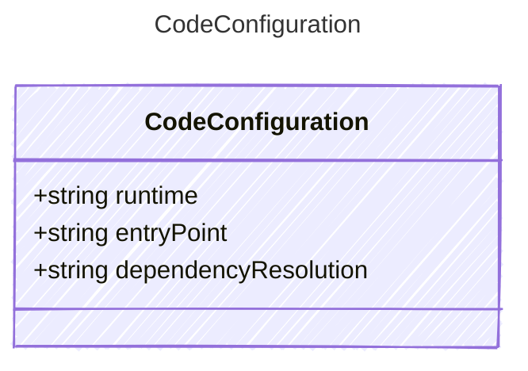

Configuration for code-based (ZIP upload) deployment of a hosted agent.
When present, the agent source code is uploaded directly instead of building a container image.

## Class Diagram



## Yaml Example

```yaml
runtime: python_3_11
entryPoint: main.py
dependencyResolution: remote_build
```

## Properties

| Name | Type | Description |
| ---- | ---- | ----------- |
| runtime | string | Runtime identifier for code execution (e.g., &#39;python_3_11&#39;, &#39;dotnet_8&#39;). |
| entryPoint | string | The entry point file for the agent (e.g., &#39;main.py&#39; for Python, &#39;HelloWorld.dll&#39; for .NET). |
| dependencyResolution | string | How package dependencies are resolved at deployment time. |
