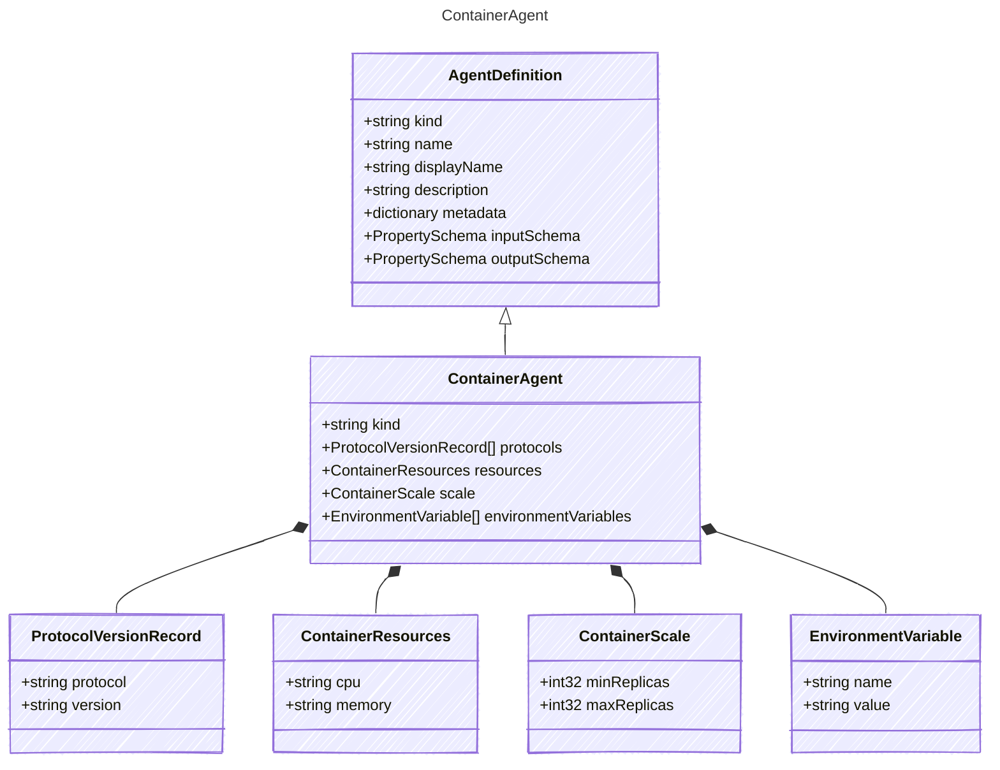

This represents a container based agent hosted by the provider/publisher.
The intent is to represent a container application that the user wants to run
in a hosted environment that the provider manages.

## Class Diagram



## Yaml Example

```yaml
kind: hosted
protocols:
  - protocol: responses
    version: v0.1.1
resources:
  cpu: "1"
  memory: 2Gi
scale:
  minReplicas: 1
  maxReplicas: 3
environmentVariables:
  - name: MY_ENV_VAR
    value: my-value
```

## Properties

| Name | Type | Description |
| ---- | ---- | ----------- |
| kind | string | Type of agent, e.g., &#39;hosted&#39; |
| protocols | [ProtocolVersionRecord[]](../protocolversionrecord/) | Protocol used by the containerized agent |
| resources | [ContainerResources](../containerresources/) | Resource allocation for the container |
| scale | [ContainerScale](../containerscale/) | Scaling configuration for the container |
| environmentVariables | [EnvironmentVariable[]](../environmentvariable/) | Environment variables to set in the container |

## Composed Types

The following types are composed within `ContainerAgent`:

- [ProtocolVersionRecord](../protocolversionrecord/)
- [ContainerResources](../containerresources/)
- [ContainerScale](../containerscale/)
- [EnvironmentVariable](../environmentvariable/)
