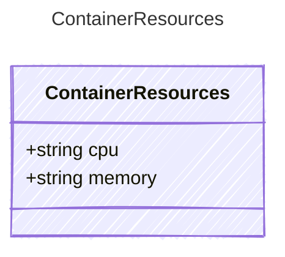

Resource allocation for a containerized agent.
Valid CPU and memory pairings depend on the target hosting provider.

## Class Diagram



## Yaml Example

```yaml
cpu: "1"
memory: 2Gi
```

## Properties

| Name | Type | Description |
| ---- | ---- | ----------- |
| cpu | string | CPU allocation for the container (e.g., &#39;0.5&#39;, &#39;1&#39;, &#39;2&#39;) |
| memory | string | Memory allocation for the container (e.g., &#39;0.5Gi&#39;, &#39;2Gi&#39;) |
