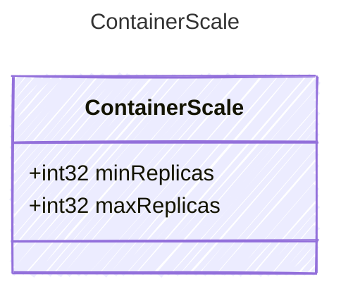

Scaling configuration for a containerized agent.

## Class Diagram



## Yaml Example

```yaml
minReplicas: 1
maxReplicas: 3
```

## Properties

| Name | Type | Description |
| ---- | ---- | ----------- |
| minReplicas | int32 | Minimum number of replicas |
| maxReplicas | int32 | Maximum number of replicas |
