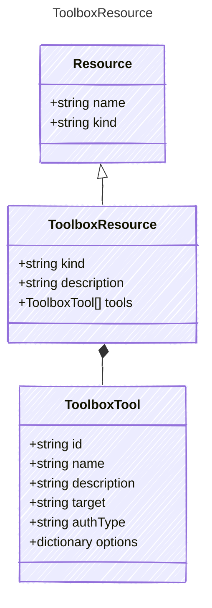

Represents a Foundry Toolbox resource — a named collection of tools
that is provisioned as a Foundry Toolbox and exposed via MCP endpoint.

## Class Diagram



## Yaml Example

```yaml
kind: toolbox
description: Shared platform tools
tools:
  - id: web_search
  - id: azure_ai_search
    options:
      indexName: products-index
  - id: mcp
    name: github-copilot
    target: https://api.githubcopilot.com/mcp
    authType: OAuth2
  - id: a2a_preview
    name: research-agent
    description: Delegates research tasks to a specialized agent
    target: https://research-agent.example.com
```

## Properties

| Name | Type | Description |
| ---- | ---- | ----------- |
| kind | string | The kind identifier for toolbox resources |
| description | string | Description of the toolbox |
| tools | [ToolboxTool[]](../toolboxtool/) | The tools contained in this toolbox |

## Composed Types

The following types are composed within `ToolboxResource`:

- [ToolboxTool](../toolboxtool/)
