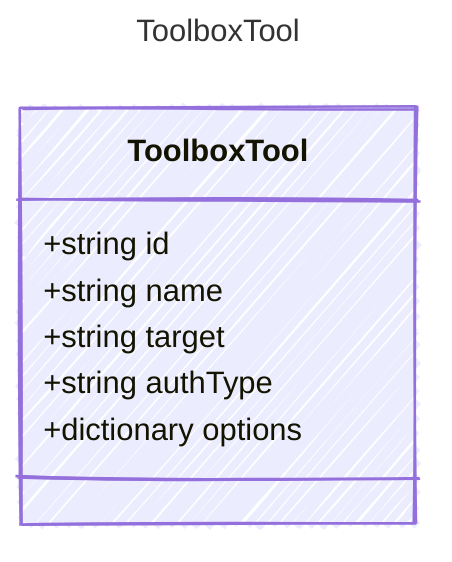

Represents a tool definition within a toolbox.
Tools can be Foundry-hosted (bing_grounding, azure_ai_search, etc.)
or external (mcp, openapi) with connection details.

## Class Diagram



## Yaml Example

```yaml
id: bing_grounding
name: my-search-tool
target: https://api.githubcopilot.com/mcp
authType: OAuth2
options:
  indexName: products-index
```

## Properties

| Name | Type | Description |
| ---- | ---- | ----------- |
| id | string | The tool type identifier (e.g., &#39;bing_grounding&#39;, &#39;azure_ai_search&#39;, &#39;mcp&#39;) |
| name | string | Optional display name for the tool |
| target | string | Target endpoint URL for external tools (e.g., MCP server URL) |
| authType | string | Authentication type for the tool connection |
| options | dictionary | Additional configuration options for the tool |
